<div align="center">



### Associate Software Engineer · Backend-Focused Full-Stack Developer

I build practical software systems with **C#, ASP.NET Core, PostgreSQL, Next.js and TypeScript** — with a focus on APIs, authentication, database design, maintainable architecture, and real-world business workflows.

<p>
  <a href="https://github.com/suvithan-lk"></a>
  <a href="https://suvithan.iceiy.com/"></a>
  <a href="https://www.linkedin.com/in/anantharasa-suvithan/"></a>
</p>

</div>

---

## Engineering Focus

<table>
<tr>
<td width="50%" valign="top">

### Backend

- C# / .NET 10
- ASP.NET Core Minimal APIs
- Entity Framework Core 10
- REST API design
- JWT authentication
- Refresh-token security
- Validation & error handling
- PostgreSQL database design

</td>
<td width="50%" valign="top">

### Modern Web

- Next.js 16 App Router
- React 19
- TypeScript
- Tailwind CSS
- Responsive UI systems
- API-driven applications
- Docker
- GitHub Actions / CI

</td>
</tr>
</table>

## Selected Work

### 01 · Opsora

**Business operations / field-service platform**

A full-stack system focused on practical operational workflows, maintainable architecture, and real-world business requirements.

**Focus:** Full-stack architecture · business workflows · API integration · maintainability

→ [View repository](https://github.com/suvithan-lk/Opsora-Z)

---

### 02 · Folia

**Personal finance management workspace**

A full-stack financial tracking application built around transparent calculations, user-scoped data, budgeting, reporting, and secure authentication.

**Stack:** Next.js 16 · React 19 · TypeScript · ASP.NET Core 10 · EF Core 10 · PostgreSQL 18 · Docker

→ [View repository](https://github.com/suvithan-lk/expense-tracker)

---

### 03 · ModernUI Portfolio

**Luxury Editorial / Quiet Luxury portfolio**

A framework-free portfolio experiment built with semantic HTML, advanced CSS, and native JavaScript APIs.

**Stack:** HTML5 · CSS3 · ES2024 · Web APIs

→ [View repository](https://github.com/suvithan-lk/ModernUI-Portfolio)

---

### 04 · Agriculture Management System

**Full-stack agricultural management platform**

A Laravel-based business application covering management workflows, products, services, and marketplace-oriented functionality.

**Stack:** Laravel · PHP · Bootstrap · MySQL

→ [View repository](https://github.com/suvithan-lk/agriculture-fullstack-laravel12-bootstrap-5-Website-Project)

---

### 05 · E-commerce Web Application

**Modern web commerce project**

A practical e-commerce implementation exploring product management, customer-facing workflows, and full-stack application structure.

→ [View repository](https://github.com/suvithan-lk/ecom-web-app)

---

## Architecture Mindset

I care about the engineering behind the UI — not just making screens look good.

```text
Client
  │
  ▼
Next.js / React
  │
  │ HTTPS + JSON
  ▼
ASP.NET Core API
  │
  ├── Authentication / Authorization
  ├── Validation
  ├── Business Logic
  ├── Error Handling
  └── DTO / API Contracts
  │
  ▼
EF Core
  │
  ▼
PostgreSQL
```

### Principles I practice

- **Secure by default** — never trust client-supplied identity or payment state.
- **Clear boundaries** — separate API contracts, business logic, persistence, and UI concerns.
- **Explicit data ownership** — queries are scoped to the authenticated user where required.
- **Predictable errors** — consistent API responses instead of leaking implementation details.
- **Maintainable code** — readable naming, small responsibilities, and feature-oriented organization.
- **Production thinking** — configuration, logging, testing, deployment, and failure cases matter.

---

## Current Direction

I'm going deeper into:

**ASP.NET Core → API architecture → PostgreSQL → authentication/security → testing → Docker → CI/CD → practical AI integrations**

The goal is not to collect frameworks. The goal is to become better at **designing, building, debugging, and shipping complete software systems**.

---

## Technology Map

| Area | Technologies |
|---|---|
| **Languages** | C#, TypeScript, JavaScript, PHP, SQL |
| **Backend** | ASP.NET Core, .NET 10, EF Core 10, Node.js, Express, Laravel |
| **Frontend** | Next.js 16, React, HTML5, CSS3, Bootstrap, Tailwind CSS |
| **Databases** | PostgreSQL, SQL Server, MySQL, MariaDB |
| **DevOps** | Docker, GitHub Actions, Linux, Cloudflare |
| **Tools** | Git, GitHub, Postman, VS Code, Visual Studio |

---

## GitHub Activity

<div align="center">


</div>

---

<div align="center">

### Building useful software. Learning deeply. Shipping deliberately.

<sub>Based in Sri Lanka · Open to meaningful engineering opportunities and collaborations.</sub>

</div>
